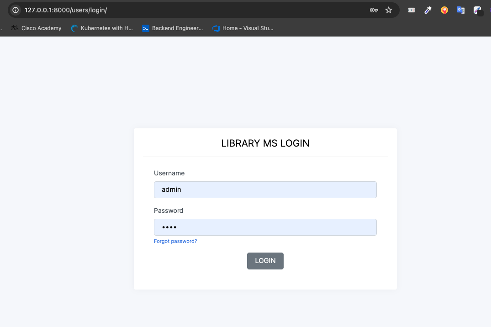
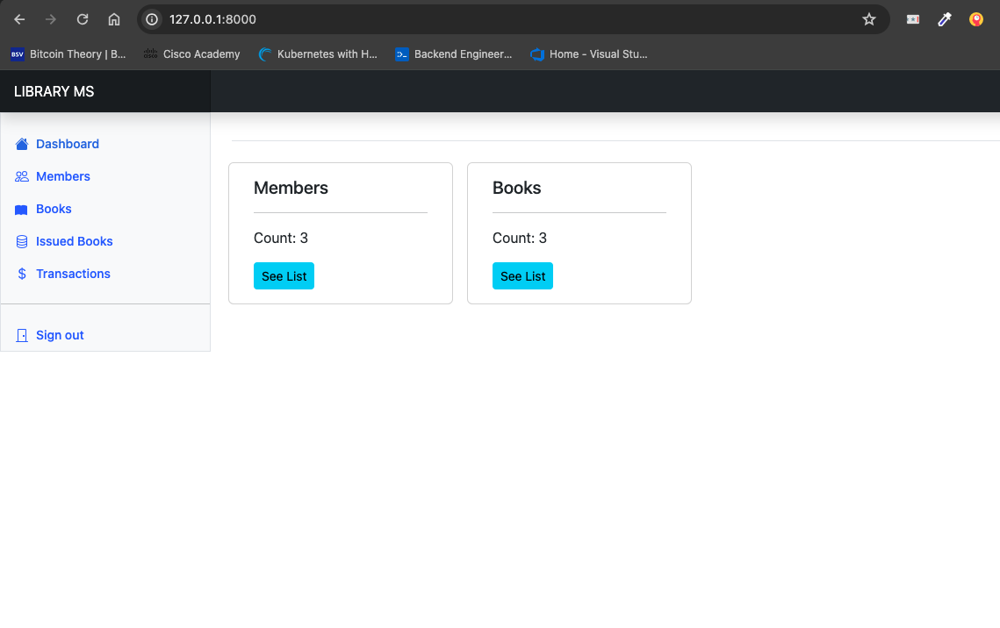
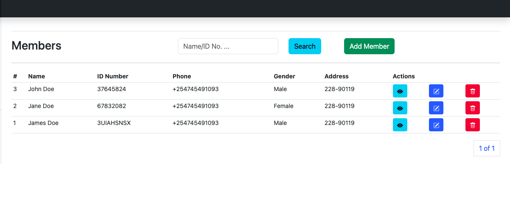
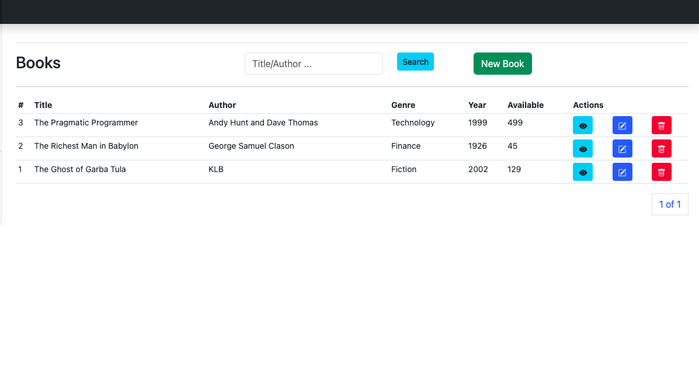
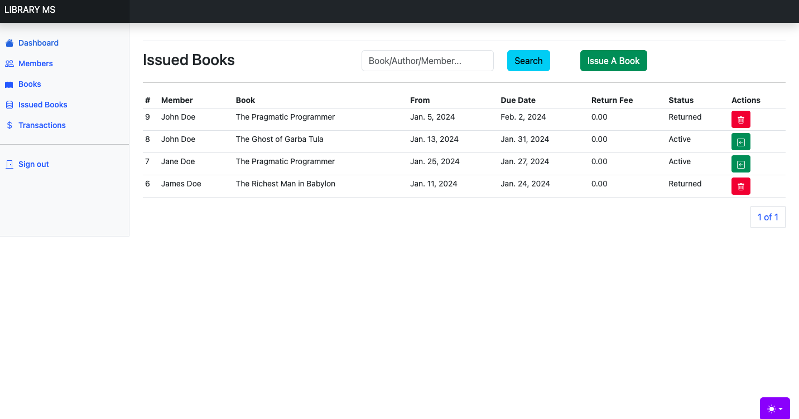

# LIBRARY MANAGEMENT WEB APPLICATION

## The web applictaion has been built using Django

### Assumptions
1. It is assumed that when a book is issued there is a flat rate charge upon the issue period
2. It is assumed that when the agreed book issue period is exceeded, the member is charged 15% of the book issue fee per day

### Hosted Version
- The web application has a version hosted on python anywhere which can be accessed here <link>https://paulndambo.pythonanywhere.com/</link>

### Sample Credentials
- password: 1234
- username: admin

## How to run
Note: 
- Before the steps below, please make sure you clone the code repository,
    To clone the repo, run the command below on your terminal/command prompt

- This statement above assumes you have git installed and setup on your local computer, 
    if not, download it here <link>https://git-scm.com/downloads<link>

``git clone https://github.com/Paulndambo/Library-Management-System.git``

## Running Tests
``python manage.py test``

### 1. Running Locally
- After cloning, 
- Install python from here if you don't have it <link>https://www.python.org/downloads/</link>
- You can either create a virtual environment to run the project or run it with a virtual environment, to see how to create virtual env refer to this article <link>https://www.freecodecamp.org/news/how-to-setup-virtual-environments-in-python/</link>
- if you chose to create the virtual environment, make sure it is activated before you can proceed.

- Assuming the above went well, run the following command;-
    1. ``cd Library-Management-System``
    2. ``pip3 install -r requirements.txt`` or ``pip install -r requirements.txt``
    3. ``python3 manage.py runserver`` or ``python manage.py runserver``

### 2. Using Docker
- Assuming you have docker installed on your computer, you can proceed, if not please refer to this link <link>https://www.docker.com/products/docker-desktop/</link>, install it before you proceed.

- After docker is successfuly installed, start it and proceed to your terminal/command line to run the following commands
    1. ``cd Library-Management-System``
    2. ``docker build -t libraryms .``
    3. ``docker run -p 8000:8000 libraryms``

#### if you have followed the steps above, you can access the web application here ()[http://127.0.0.1:8000]

## Example Screenshots
1. Login Page

2. Dashboard Page

3. Members Page

4. Books Page

5. Issued Books Page
